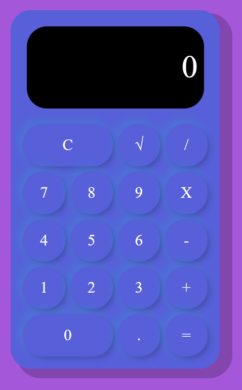

<H1>P-3 ANUSKA  CALCULATOR</H1>

Anuska calculator is a calculator that performs basic arithmetic operations, including square root, percentage and numbers with decimals.

🎯 OBJECTIVE

This project is very useful for those people who want to have an easy-to-understand calculator on their mobile device, with buttons and numbers suitable for people with poor visibility.

 🌈 Main features:

<ul>
   <li> Basics Operations</li>
   <li> Advanced Features</li>

</ul>

📷 ScreenShot

💻  The technologies used have been:

  

 💽 Installation

  1. Clone this repository in your Visual Studio

    https://github.com/Anuskota/calculadora-JS.git

    It is necessary to install visual studio code on your computer to be able to develop all the code for this calculator.

    It does not require external sources or file images.

  2. Open the index.html file and it is ready you can use.

 <h2> 🎉It´s Easy!! </h2>
